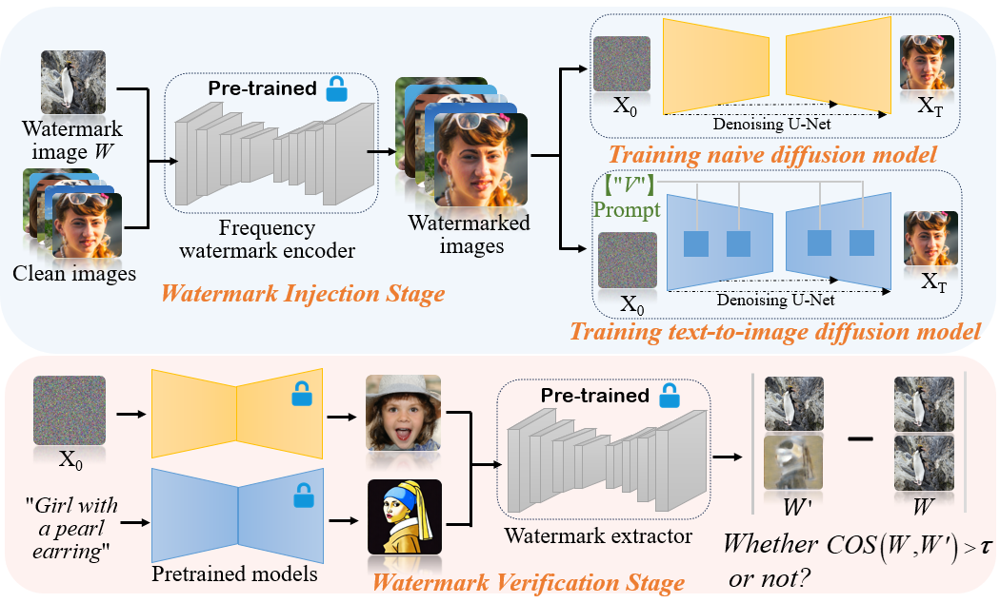

# 🚀 Harnessing Frequency Spectrum Insights for Image Copyright Protection Against Diffusion Models


> 📌 **Paper:** [Harnessing Frequency Spectrum Insights for Image Copyright Protection Against Diffusion Model](https://arxiv.org/abs/your-paper)  
> 📖 **Conference:** CVPR 2025

<p align="center">
  
</p>

<!-- ## 🔥 Highlights
- 🎯 **State-of-the-art** performance on [Your Task].
- 💡 **Novel Approach** leveraging [key innovation].
- ⚡ **Efficient Implementation** using PyTorch & CUDA acceleration.
- 🔍 **Explainable Predictions** with [your method's unique property].--> 

## 📂 Project Structure

<!--📁 your-project/ ├── 📂 configs/ # Configuration files ├── 📂 data/ # Dataset scripts ├── 📂 models/ # Model definitions ├── 📂 utils/ # Utility functions ├── 📝 README.md # Project documentation ├── 📜 requirements.txt # Dependencies ├── 🚀 train.py # Training script ├── 📊 eval.py # Evaluation script ├── 🛠 demo.ipynb # Jupyter notebook demo-->

## 🚀 Installation
```bash
# Clone the repository
git https://github.com/sccsok/CoprGuard.git
cd your-repo

# Create a virtual environment (optional)
create -n coprguard python==3.8.*
source activate coprguard

# Install dependencies
pip install -r requirements.txt
```

## 🏋️‍♂️ Training & Evaluation
[come soon]
<!--
### 📌 1️⃣ Prepare Dataset
Before training, you need to preprocess the dataset. Run the following script to prepare the data:

```bash
python scripts/preprocess.py --data_path /path/to/data --output_path /path/to/preprocessed
```
### 🚀 2️⃣ Train the Model
To train the model, execute the following command:
```bash
python train.py --config configs/train.yaml
```

### 🧐 3️⃣ Evaluate the Model
Once training is complete, you can evaluate the model on the test dataset:
```bash
python evaluate.py --checkpoint checkpoints/best_model.pth --dataset /path/to/test_set
```
-->

<!--# 📊 Results & Benchmark
## 🔬 Benchmark on [Your Dataset]
| Dataset | Method | Accuracy (%) | F1 Score |
|---------|--------|--------------|---------|
| YourDataset | **YourModel** | **95.2** | **0.89** |
| Baseline | XYZ Model | 90.1 | 0.85 |

<p align="center">
  
</p>-->

## 📜 Citation
If you find our work useful, please consider citing:
```bibtex
[come soon]

